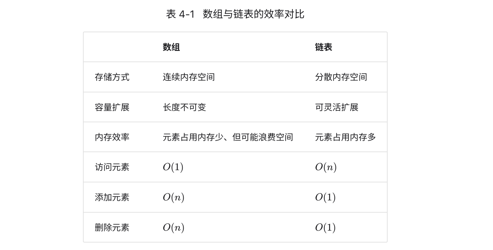

# HELLO ALGO

[在线阅读](https://www.hello-algo.com/chapter_hello_algo/)


## 第一章 认识算法

### 生活中的算法

- 二分查找：查字典，有序数组
- 插入排序：整理扑克，处理小型数据集时非常高效
- 贪心：超市找零

### 算法的定义

- 算法：在有限时间内解决特定问题的一组指令或操作步骤
- 算法特性：
  - 问题是明确的（有清晰的输入和输出定义）
  - 具有可行性，能够在有限的步骤、时间、空间下完成
  - 各步骤都有明确的含义，在相同的输入和运行条件下，输出始终相同

- 数据结构：组织和存储数据的方式，涵盖数据内容、数据之间的关系和数据操作方法
- 设计目标
  - 空间占用尽量少
  - 数据操作尽可能快速
  - 提供简洁的数据表示和逻辑信息，以便算法高效运行

**数据结构设计是一个充满权衡的过程**。

数据结构与算法，简称算法。

LeeCode其实考的知识点是：数据结构、算法。


## 第二章 复杂度分析

### 算法效率评估

- 算法设计目标：**既快又省**
  - 找到问题解法
  - 寻求最优解（时间效率、空间效率）

- 效率评估方法
  - 实际测试：有较大的局限性
  - 理论估算：**渐进复杂度分析**（简称：复杂度分析）
- 复杂度分析：**描述了随着输入数据大小的增加，算法所需的时间和空间的增长趋势**

### 迭代和递归

迭代、递归（两种基本的程序控制结构）实现重复执行任务

#### 迭代

- 一定的条件下重复执行某段代码，直到这个条件不再满足
- for循环：
  - **适合在预先知道迭代次数时使用**
  - 代码更紧凑
- while循环：
  - 程序每轮都会先检查条件，如果条件为真，则继续执行，否则就结束循环
  - 更加灵活
- 嵌套循环
  - 添加嵌套循环，每一次嵌套都是一次“升维”，将会使时间复杂度提高至“立方关系”“四次方关系”，以此类推

#### 递归

- 一种算法策略，通过函数调用自身来解决问题
- 递归三要素
  - 终止条件：用于决定什么时候 “递”  转 “归”。
  - 递归调用
  - 返回结果

```js
/* 递归 */
function recur(n) {
    // 终止条件
    if (n === 1) return 1;
    // 递：递归调用
    const res = recur(n - 1);
    // 归：返回结果
    return n + res;
}
```

#### 迭代 与 递归

迭代与递归特点对比

|          | 迭代                                   | 递归                                                         |
| -------- | -------------------------------------- | ------------------------------------------------------------ |
| 实现方式 | 循环结构                               | 函数调用自身                                                 |
| 时间效率 | 效率通常较高，无函数调用开销           | 每次函数调用都会产生开销                                     |
| 内存使用 | 通常使用固定大小的内存空间             | 累积函数调用可能使用大量的栈帧空间                           |
| 适用问题 | 适用于简单循环任务，代码直观、可读性好 | 适用于子问题分解，如树、图、分治、回溯等，代码结构简洁、清晰 |

$$
例如：(1)例如：f(n)=1+2+...+n
$$

- 迭代：从最基础的步骤开始，不断重复或累加，直至任务完成
  - 从 1遍历到 n，每轮执行求和操作

- 递归：将原问题分解成更小的子问题，子问题与原问题形式相同，子问题继续分解，直至基本情况为止。
  - f(n) = n + f(n-1),   f(n-1) = n-1 + f(n-2), 不断分解，直到 f(1) = 1
  - 递归通常比迭代更加耗费内存空间
  - 递归通常比循环的时间效率更低
  - 尾递归：**函数在返回前的最后一步才进行递归调用**，空间效率上与迭代相当。
  - 递归树：处理”分治“相关算法问题，递归更直观，如 “斐波那契数列”

```js
// 尾递归
function tailRecur(n, res) {
	// 终止条件
	if (n === 0) return res
  // 尾递归调用
  return tailRecur(n - 1, res + n)
}
```

> 例题：给定一个斐波那契数列 0,1,1,2,3,5,8,13,… ，求该数列的第 𝑛 个数字。
> $$
> f(1) = 0
> $$
>
> $$
> f(2) = 1
> $$
>
> $$
> f(n) = f(n-1) + f(n-2)
> $$
>
> ```js
> function fib(n) {
>   // 终止条件 f(1) = 0, f(2) = 1
>   if (n === 1 || n ===2) return n-1
>   // 递归调用
>   const res = fib(n-1) + fib(n-2)
>   return res
> }
> ```
>
> 

### 时间复杂度

- 时间复杂度分析
  - 本质上是计算“操作数量”的渐近上界

- 函数渐进上限
  - 若存在正实数 𝑐 和实数 𝑛0 ，使得对于所有的 𝑛>𝑛0 ，均有 𝑇(𝑛)≤𝑐⋅𝑓(𝑛) ，则可认为 𝑓(𝑛) 给出了 𝑇(𝑛) 的一个渐近上界，记为 𝑇(𝑛)=𝑂(𝑓(𝑛)) 。
- 推算方法
  1. 统计操作数量
     1. 从上到下，逐行计算
     2. 忽略 𝑇(𝑛) 中的系数和常数
     3. **循环嵌套时使用乘法**，总操作数量等于外层循环和内层循环操作数量之积，每一层循环操作参考1和2
  2. 判断渐近上界
     1. **时间复杂度由 𝑇(𝑛) 中最高阶的项来决定**。因为在 𝑛 趋于无穷大时，最高阶的项将发挥主导作用，其他项的影响都可以忽略。

```js
// 统计操作数量 𝑇(𝑛) = n*n + n
function algorithm(n) {
    let a = 1;  // +0（技巧 1）
    a = a + n;  // +0（技巧 1）
    // +n（技巧 2）
    for (let i = 0; i < 5 * n + 1; i++) {
        console.log(0);
    }
    // +n*n（技巧 3）
    for (let i = 0; i < 2 * n; i++) {
        for (let j = 0; j < n + 1; j++) {
            console.log(0);
        }
    }
}
```

时间复杂度：𝑂(𝑛^2^)

- 常见时间复杂度类型

$$
O(1) < O(logn) < O(n) < O(nlogn) < O(n^2) < O(2^n) < O(n!)
$$

常数阶 < 对数阶 < 线性阶 < 线性对数阶 < 平方阶 < 指数阶 < 阶乘阶


n：输入数据大小 /  输入的数组或链表长度 / n轮 

- 常数阶：与n无关
- 对数阶 *O(logn)*
  - 反映了“每轮缩减到一半”的情况
  - 比如：循环里有 n = n/2
  - 递归函数
  - 基于分治策略的算法：“一分为多”和“化繁为简”
- 线性阶:  单层循环
- 线性对数阶 *O(nlogn)*
  - 两层嵌套循环，时间复杂度分别为 *O(logn)* 和 *O(n)*
  - 主流排序算法：快速排序、归并排序、堆排序
- 平方阶：双层循环
- 指数阶：
  - 细胞分裂、递归函数（其递归地一分为二，经过 𝑛 次分裂后停止）
  - 穷举法（暴力搜索、回溯等）
  - 不适合大规模数据
- 阶乘阶 *O(n!)*
  - 全排列、递归
  - 当 𝑛≥4 时恒有 𝑛!>2^𝑛^ ，不适合大规模数据

- 最差、最佳、平均时间复杂度

- 最差**𝑂(𝑛) ** ，给出了**效率安全值** ，常用
- 最佳 **Ω(1)** 
- 平均

### 空间复杂度

- 用于衡量算法占用内存空间随着数据量变大时的**增长趋势**
- 一般情况下，**空间复杂度 = 暂存空间（暂存数据 + 栈帧空间） + 输出空间**
- 算法相关空间：
  - 输入空间
  - 暂存空间：用于存储算法在运行过程中的变量、对象、函数上下文等数据
    - 暂存数据：各种常量、变量、对象
    - 栈帧空间：每次调用函数时都会在栈顶部创建一个栈帧，函数返回后，栈帧空间会被释放。
    - 指令空间：忽略不计
  - 输出空间

- **最差空间复杂度**
  - **以最差输入数据为准**
  - **以算法运行中的峰值内存为准**

$$
O(1) < O(logn) < O(n) < O(n^2) < O(2^n)
$$

常数阶 < 对数阶 < 线性阶 < 平方阶 < 指数阶v

- 注意事项

  - **在递归函数中，需要注意统计栈帧空间

  - 常数阶：在**循环中**初始化变量或调用函数而占用的内存，在进入下一循环后就会被释放，因此不会累积占用空间，空间复杂度仍为 𝑂(1) ：
  - 线性阶：元素数量与 𝑛 成正比的数组、链表、栈、队列等：尾递归通常认为*O(n)*
  - 平方阶：矩阵、图，元素数量与 n 成平方关系
  - 指数阶：二叉树
  - 对数阶：分治，如 归并排序。将数字转化为字符串

## 第三章 数据结构

### 数据结构分类

- 逻辑结构
  - 线性： 1:1
  - 非线性
    - 树形：树、堆，1:n
    - 网状：图，n:n


- 物理结构
  - 连续空间存储
  - 分散空间存储
- 所有数据结构都是基于数组、链表或二者的组合实现的
  - **基于数组可实现**：栈、队列、哈希表、树、堆、图、矩阵、张量（维度 ≥3 的数组）等。
  - **基于链表可实现**：栈、队列、哈希表、树、堆、图等。


## 第四章 数组与链表

### 数组 array

- 线性，连续空间存储，元素+索引
- 初始化数组

- - 无初始值: `var arr = new Array(5).fill(0)`
  - 给定初始值: `var nums = [1, 2, 3, 4, 5]`

- **索引本质上是内存地址的偏移量**。首个元素的地址偏移量是 0 。
- 数组访问
  - 元素内存地址 = （首个元素）数组内存地址 + 元素索引 * 元素长度

- `JavaScript` 的 `Array` 是动态数组，可以直接扩展
- 数组典型应用
  - **随机访问**：如果我们想随机抽取一些样本，那么可以用数组存储，并生成一个随机序列，根据索引实现随机抽样。
  - **排序和搜索**：快速排序、归并排序、二分查找等都主要在数组上进行。
  - **查找表**：key-value
  - **机器学习**：神经网络中大量使用了向量、矩阵、张量之间的线性代数运算，这些数据都是以数组的形式构建的。
  - **数据结构实现**：数组可以用于实现栈、队列、哈希表、堆、图等数据结构。例如，图的邻接矩阵表示实际上是一个二维数组。

### 链表 linked list

- 线性、分散空间存储，节点：值+引用，头节点、尾节点（指向null）
- 因此在相同数据量下，**链表比数组占用更多的内存空间**。
- 链表常用操作
  - 建立链表
    - 初始化各节点对象
    - 构建节点之间的引用关系
  - 插入、删除：时间复杂度 *O(1)*
  - 访问链表：从头节点开始，逐个遍历 ，时间复杂度*O(n)*
- 链表类型
  - 单向链表：头节点，尾节点
  - 双向链表：前躯节点、后继节点
  - 环形链表：首尾相连，任何节点都可以是头节点、
- 链表典型应用
  - 单向链表：队列、栈、哈希表、图
  - 双向链表：常用于需快速查找前一个和后一个元素的场景
    - 高级数据结构：红黑树、B树
    - 浏览器历史
    - LRU，缓存淘汰算法，要找到最近最少用的数据，以支持快速添加和删除节点
  - 环形链表：常用于需要周期性操作的场景，比如操作系统的资源调度
    - 时间片轮转调度算法：
    - 数据缓冲区：


### 列表list

- 元素的有序集合，列表可以基于链表或数组实现（动态数组最好，更加灵活）。
- 列表 =同等概念= 动态数组
- 列表常用操作
  - 初始化列表：有初始值、无初始值
  - 访问元素：*O(1)*
  - 插入和删除元素： *O(n)*
  - 列表拼接：`num.push(...nums1)`
  - 列表排序：`nums.sort((a, b) => a - b)` 从小到大排序
  - 构建列表
    - 初始容量
    - 数量记录：用于判断是否需扩容
    - 扩容机制

## 数组 vs 链表



# 其他

## 语法糖

- 简化代码、提高可读性，是语言特性
- 示例
  - 箭头函数：更简洁的方式来定义函数
  - 模板字符串：允许在字符串中嵌入表达式
  - 解构赋值：允许从数组或对象中快速提取值并赋给变量
  - **类（Class）**：提供了一种基于原型继承的语法糖，使得定义构造函数和原型方法更加简洁。

```js
// 箭头函数
const add = (a, b) => a + b

// 模板字符串
console.log(`Hello ${name}`)

// 解构赋值
const [first, second] = array[1, 2, 3]
// first 1
// second 2

// 传统 构造函数 和 原型方法
function People(name) {
  this.name = name
}

People.prototype.say() = function () {
  // People 的 方法
  console.log('123')
}

// 类
Class Person() {
  constructor(name) {
    this.name = name
  }
  say() {
    console.log('123')
  }
}
```


